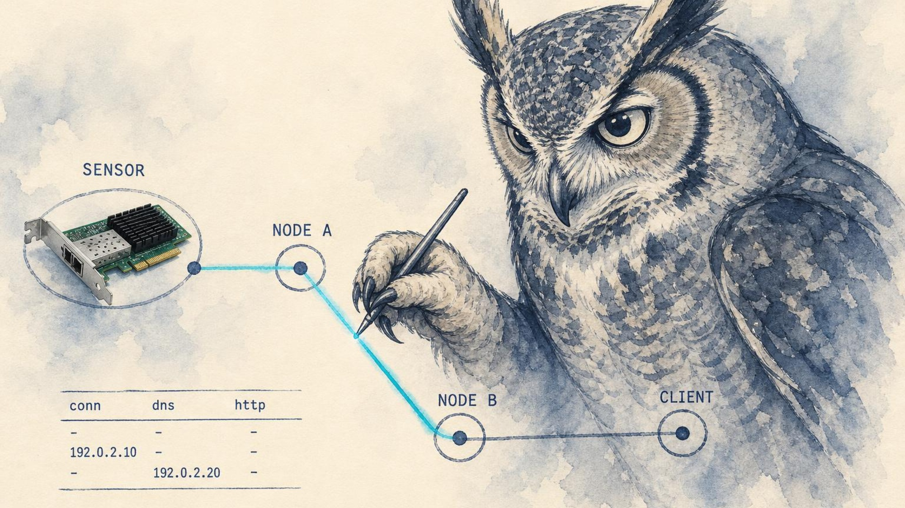

<p align="center">
  
</p>

<h1 align="center">zeek-mcp</h1>

<p align="center"><strong>Analyze Zeek and Suricata network logs from your AI client.</strong></p>

<p align="center">
  <a href="https://lidless.dev/zeek-mcp"><strong>Website</strong></a>
  &nbsp;&middot;&nbsp;
  <a href="https://www.npmjs.com/package/zeek-mcp">npm</a>
  &nbsp;&middot;&nbsp;
  <a href="#tools">Tools</a>
  &nbsp;&middot;&nbsp;
  <a href="#quickstart">Quickstart</a>
</p>

<p align="center">
  
  
  
  
</p>

zeek-mcp is a Model Context Protocol (MCP) server that lets an AI client read, query, and correlate [Zeek](https://zeek.org/) and [Suricata](https://suricata.io/) network security monitoring logs. It exists because network telemetry lives in dense per-protocol log files (conn, dns, http, ssl, files, notice, plus Suricata `eve.json`) that are tedious to grep by hand during an investigation, and an LLM is good at pivoting across them if you give it structured access. It differs from a generic log-reader MCP by speaking Zeek and Suricata natively: it parses both JSON and TSV, understands CIDR and wildcard matching, walks date-rotated and gzipped archives, and ships purpose-built detections (beaconing, DNS tunneling, JA3 hunting, anomaly and baseline analysis) rather than handing the model raw text.

## What it does

zeek-mcp turns a Zeek and Suricata sensor into a queryable surface for an AI agent doing network security monitoring (NSM). Point it at your Zeek log directory and Suricata `eve.json`, register it with any MCP client, and the model can search connection logs, follow a connection UID across every log type, profile DNS for DGA and tunneling, inspect SSL/TLS certificates and JA3 fingerprints, find executable downloads on the wire, cross-reference Suricata alerts against Zeek context, and escalate findings into TheHive or MISP. Detection logic that would otherwise be a pile of ad-hoc queries (C2 beaconing by interval regularity, statistical anomaly detection, network baselining) is exposed as first-class tools, so the agent asks one question instead of reconstructing the analysis from raw logs every time.

It reads logs; it does not run the sensor, mutate capture, or replace your SIEM. Everything is read-only against Zeek and Suricata data, with the single exception of the optional TheHive and MISP tools that create alerts, cases, and events when you provide credentials.

## Installation

```bash
git clone https://github.com/lidless-labs/zeek-mcp.git
cd zeek-mcp
npm install
npm run build
```

## Prerequisites

- Node.js 20+
- Zeek sensor generating logs (JSON or TSV format)
- Suricata (optional, for IDS alert correlation)

## Quickstart

zeek-mcp is published on npm and runs over stdio, so any MCP client can launch it with `npx`. Add this to your client's MCP config (the example below is for Claude Desktop / Claude Code, adjust env paths to your sensor):

```json
{
  "mcpServers": {
    "zeek": {
      "command": "npx",
      "args": ["-y", "zeek-mcp"],
      "env": {
        "ZEEK_LOG_DIR": "/opt/zeek/logs/current",
        "ZEEK_LOG_FORMAT": "tsv",
        "SURICATA_EVE_LOG": "/opt/suricata/logs/eve.json"
      }
    }
  }
}
```

Then ask your agent something like *"summarize the top talkers in the last connection log and flag any beaconing"* and it will call the relevant tools.

To try it locally against the bundled sample data:

```bash
npx -y zeek-mcp   # or: git clone, npm install, npm run build, then node dist/index.js
```

Set `ZEEK_LOG_DIR` to the included `test-data/` directory to explore without a live sensor (see [Development](#development)).

## Usage

### Claude Desktop

Add to `~/Library/Application Support/Claude/claude_desktop_config.json` (macOS) or `%APPDATA%\Claude\claude_desktop_config.json` (Windows):

```json
{
  "mcpServers": {
    "zeek": {
      "command": "npx",
      "args": ["-y", "zeek-mcp"],
      "env": {
        "ZEEK_LOG_DIR": "/opt/zeek/logs/current",
        "ZEEK_LOG_FORMAT": "tsv",
        "SURICATA_EVE_LOG": "/opt/suricata/logs/eve.json"
      }
    }
  }
}
```

### Claude Code

```bash
claude mcp add zeek \
  --env ZEEK_LOG_DIR=/opt/zeek/logs/current \
  --env ZEEK_LOG_FORMAT=tsv \
  --env SURICATA_EVE_LOG=/opt/suricata/logs/eve.json \
  -- npx -y zeek-mcp
```

Add `--scope user` to make it available from any directory instead of only the current project.

### OpenClaw

With the published package:

```bash
openclaw mcp set zeek '{
  "command": "npx",
  "args": ["-y", "zeek-mcp"],
  "env": {
    "ZEEK_LOG_DIR": "/opt/zeek/logs/current",
    "ZEEK_LOG_FORMAT": "tsv",
    "SURICATA_EVE_LOG": "/opt/suricata/logs/eve.json"
  }
}'
```

Or, when running from a source checkout instead of the npm package, point `command`/`args` at the built `dist/index.js`:

```bash
openclaw mcp set zeek '{
  "command": "node",
  "args": ["/absolute/path/to/zeek-mcp/dist/index.js"],
  "env": {
    "ZEEK_LOG_DIR": "/opt/zeek/logs/current",
    "ZEEK_LOG_FORMAT": "tsv",
    "SURICATA_EVE_LOG": "/opt/suricata/logs/eve.json"
  }
}'
```

Then restart the OpenClaw gateway so the new server is picked up:

```bash
systemctl --user restart openclaw-gateway
openclaw mcp list   # confirm "zeek" is registered
```

### Codex CLI

[Codex CLI](https://github.com/openai/codex) registers MCP servers via `codex mcp add`:

```bash
codex mcp add zeek \
  --env ZEEK_LOG_DIR=/opt/zeek/logs/current \
  --env ZEEK_LOG_FORMAT=tsv \
  --env SURICATA_EVE_LOG=/opt/suricata/logs/eve.json \
  -- npx -y zeek-mcp
```

Codex writes the entry to `~/.codex/config.toml` under `[mcp_servers.zeek]`. Verify with `codex mcp list`.

### Standalone

```bash
ZEEK_LOG_DIR=/opt/zeek/logs/current ZEEK_LOG_FORMAT=tsv node dist/index.js
```

### Development

```bash
ZEEK_LOG_DIR=./test-data npm run dev
```

## Tools

zeek-mcp registers **39 tools**. Read-only Zeek/Suricata query and analysis tools make up most of the set; the TheHive and MISP tools are the only ones that write, and only when you supply credentials.

### Connection Analysis

| Tool | Description |
|------|-------------|
| `zeek_query_connections` | Search connection logs with flexible filters (CIDR, protocol, duration, bytes) |
| `zeek_connection_summary` | Statistical summary: top talkers, services, bytes, connection counts |
| `zeek_long_connections` | Find long-lived connections (potential C2 beacons, tunnels) |

### DNS Analysis

| Tool | Description |
|------|-------------|
| `zeek_query_dns` | Search DNS queries with domain wildcards and response code filtering |
| `zeek_dns_summary` | Top domains, NXDOMAIN counts (DGA detection), query type distribution |
| `zeek_dns_tunneling_check` | Detect DNS tunneling via entropy analysis and encoding detection |

### HTTP Analysis

| Tool | Description |
|------|-------------|
| `zeek_query_http` | Search HTTP requests by host, URI, method, user agent, status code |
| `zeek_suspicious_http` | Find suspicious HTTP: POSTs to IPs, unusual agents, large bodies, base64 in URLs |

### SSL/TLS Analysis

| Tool | Description |
|------|-------------|
| `zeek_query_ssl` | Search SSL/TLS by SNI, version, validation status, certificate fields |
| `zeek_expired_certs` | Find expired, self-signed, or invalid certificates |

### File Analysis

| Tool | Description |
|------|-------------|
| `zeek_query_files` | Search file extractions by MIME type, hash, filename, size |
| `zeek_executable_downloads` | Find executable transfers (PE, ELF, scripts) on the wire |

### Security Notices

| Tool | Description |
|------|-------------|
| `zeek_query_notices` | Search Zeek security notices (port scans, invalid certs, custom alerts) |

### SSH Analysis

| Tool | Description |
|------|-------------|
| `zeek_query_ssh` | Search SSH connections by auth status, direction, client/server |
| `zeek_ssh_bruteforce` | Detect SSH brute force attempts exceeding a failure threshold |

### DHCP & Asset Discovery

| Tool | Description |
|------|-------------|
| `zeek_query_dhcp` | Search DHCP logs for lease assignments and device discovery |
| `zeek_dhcp_asset_map` | Build MAC-to-IP/hostname asset map for network inventory |

### Cross-Log Investigation

| Tool | Description |
|------|-------------|
| `zeek_investigate_host` | Full host investigation across all log types |
| `zeek_investigate_uid` | Follow a connection UID across all log types |

### Software Discovery

| Tool | Description |
|------|-------------|
| `zeek_software_inventory` | List detected software and versions on the network |

### Analytics

| Tool | Description |
|------|-------------|
| `zeek_detect_beaconing` | Detect C2 beaconing by analyzing connection interval regularity and jitter |
| `zeek_detect_anomalies` | Statistical anomaly detection: port scans, data exfiltration, unusual ports |
| `zeek_ja3_fingerprints` | Extract and analyze JA3/JA3S TLS fingerprints from SSL logs |
| `zeek_ja3_hunt` | Hunt known-malicious JA3 fingerprints (CobaltStrike, Emotet, TrickBot, etc.) across SSL logs |
| `zeek_network_baseline` | Generate a statistical baseline of normal network activity as a reference point |
| `zeek_detect_outliers` | Compare current activity against a baseline and flag statistical outliers |

### Suricata IDS

| Tool | Description |
|------|-------------|
| `suricata_query_alerts` | Search Suricata alerts by signature, severity, IP, protocol, time |
| `suricata_alert_summary` | High-level alert summary: top signatures, categories, IPs, severity distribution |
| `suricata_correlate_zeek` | Cross-reference Suricata alerts with Zeek logs for full context |
| `suricata_eve_stats` | Suricata engine statistics: packets, flows, detection performance |

### PCAP Analysis

| Tool | Description |
|------|-------------|
| `pcap_list` | List available PCAP files in the capture directory with sizes and timestamps |
| `pcap_analyze` | Replay a PCAP file through Zeek and return the generated log summary |

### Incident Response

| Tool | Description |
|------|-------------|
| `thehive_create_alert` | Create a TheHive alert from NIDS findings (observables, severity, TLP) |
| `thehive_create_case` | Create a TheHive case for in-depth, collaborative investigation |
| `thehive_search_cases` | Search existing TheHive cases and alerts for related work or duplicates |
| `misp_search_iocs` | Search MISP for IOCs (IPs, domains, hashes, URLs) and return matching events |
| `misp_bulk_lookup` | Check multiple IOCs against MISP in a single call |
| `misp_add_event` | Create a MISP event from NIDS findings to share threat intelligence |

### Sensor Management

| Tool | Description |
|------|-------------|
| `nids_sensor_status` | Live sensor status: log inventory, sizes, freshness, health checks |

## Resources

| Resource | URI | Description |
|----------|-----|-------------|
| Log Types | `zeek://log-types` | All Zeek log types with field descriptions |
| Stats | `zeek://stats` | Sensor statistics and available log types |

## Prompts

| Prompt | Description |
|--------|-------------|
| `triage-alert` | Triage a Suricata alert by cross-referencing with Zeek logs |
| `investigate-host` | Guided host investigation workflow across all logs |
| `hunt-for-c2` | Threat hunting for C2 communication patterns |
| `network-baseline` | Generate a network activity baseline |

## Supported Log Types

conn, dns, http, ssl, files, notice, weird, x509, smtp, ssh, dpd, software, dhcp, ntp, ocsp, websocket

## Configuration

### Zeek

| Variable | Default | Description |
|----------|---------|-------------|
| `ZEEK_LOG_DIR` | `/opt/zeek/logs/current` | Path to current Zeek logs |
| `ZEEK_LOG_ARCHIVE` | `/opt/zeek/logs` | Path to archived/rotated logs |
| `ZEEK_LOG_FORMAT` | `json` | Log format: `json` or `tsv` |
| `ZEEK_MAX_RESULTS` | `1000` | Maximum results per query |

### Suricata

| Variable | Default | Description |
|----------|---------|-------------|
| `SURICATA_EVE_LOG` | `/opt/suricata/logs/eve.json` | Path to Suricata eve.json |
| `SURICATA_FAST_LOG` | `/opt/suricata/logs/fast.log` | Path to Suricata fast.log |
| `SURICATA_RULES_DIR` | `/opt/suricata/rules` | Path to Suricata rules directory |

### PCAP Analysis

| Variable | Default | Description |
|----------|---------|-------------|
| `PCAP_DIR` | `/opt/pcaps` | Directory of PCAP files. `pcap_analyze` confines all filenames (relative and absolute) to this directory; anything resolving outside it is rejected. |
| `ZEEK_BINARY` | `/usr/local/zeek/bin/zeek` | Path to the Zeek binary. |
| `ZEEK_CONTAINER` | `zeek` | Docker container to run Zeek in. Set to empty to run Zeek directly on the host. |
| `PCAP_OUTPUT_DIR` | `/tmp/zeek-pcap-analysis` | Working directory for generated logs. |

### MISP

| Variable | Default | Description |
|----------|---------|-------------|
| `MISP_URL` | `https://localhost` | MISP base URL. | <!-- content-guard: allow localhost-bare -->
| `MISP_API_KEY` | (none) | MISP API key. Required for MISP tools. |
| `MISP_VERIFY_SSL` | `true` | Set to `false` to disable TLS certificate verification for MISP requests only (useful for self-signed MISP certs). Scoped to the MISP connection via a dedicated dispatcher; it does not affect any other connection or set global TLS options. |

### TheHive

| Variable | Default | Description |
|----------|---------|-------------|
| `THEHIVE_URL` | `http://localhost:9000` | TheHive base URL. | <!-- content-guard: allow localhost-port -->
| `THEHIVE_API_KEY` | (none) | TheHive API key. Required for TheHive tools. |
| `THEHIVE_VERIFY_SSL` | `true` | Set to `false` to disable TLS certificate verification for TheHive requests only (useful for self-signed certs). Scoped to the TheHive connection; it does not affect any other connection or set global TLS options. |

## Features

- **39 tools** for querying and analyzing Zeek + Suricata logs
- **2 resources** for log type metadata and sensor stats
- **4 prompts** for guided investigation workflows
- **Dual format support** - JSON and TSV (Zeek's native tab-separated format)
- **Suricata integration** - Query `eve.json` alerts, cross-correlate with Zeek, engine stats
<!-- content-guard: allow private-ipv4 -->
- **CIDR matching** - Filter by IP ranges (10.0.0.0/8, 192.168.1.0/24) with full IPv6 support
- **Wildcard matching** - Search domains and URIs with patterns (`*.example.com`)
- **Beaconing detection** - Statistical C2 beacon analysis with jitter scoring
- **Anomaly + baseline detection** - Port scan, data exfiltration, unusual ports, statistical outliers vs a baseline
- **DNS tunneling detection** - Shannon entropy analysis with encoding detection
- **JA3/JA3S fingerprinting** - Track TLS clients and hunt known-malicious fingerprints across SSL logs
- **PCAP replay** - Run a packet capture through Zeek and analyze the generated logs
- **Incident response** - Escalate findings into TheHive (alerts/cases) and MISP (IOC lookups/events)
- **DHCP asset mapping** - MAC-to-IP/hostname device inventory
- **Compressed + rotated logs** - Reads `.gz` archives and navigates Zeek's date-based log directories

## Why not something else?

- **Grepping the logs by hand.** Zeek and Suricata logs are precise but verbose, and a real investigation means pivoting from one connection UID into dns, http, ssl, and files. zeek-mcp gives the agent a `zeek_investigate_uid` / `zeek_investigate_host` pivot and structured filters instead of you reconstructing `awk` one-liners under pressure.
- **A generic file/log MCP.** A plain log-reader hands the model raw lines and hopes it parses them. zeek-mcp understands Zeek's TSV header format and Suricata's `eve.json` schema, does CIDR and IPv6 matching, reads gzipped and date-rotated archives, and ships detections (beaconing, DNS tunneling, JA3 hunting) that a generic reader cannot.
- **Your SIEM's query language.** A SIEM is the system of record. zeek-mcp is the lightweight, local, stdio path for an AI agent to read the same telemetry directly off the sensor during triage or homelab work, with no indexing tier or query DSL to learn. Use both: investigate quickly here, escalate to TheHive/MISP from the same session.

## What zeek-mcp is not

zeek-mcp is not a Zeek/Suricata replacement, a packet-capture engine, a SIEM, or a background agent.

It does not:

- run, configure, or manage your Zeek or Suricata sensor
- capture packets or modify traffic (it reads logs, and replays existing PCAPs only on request)
- index, store, or retain your telemetry between calls
- run on a schedule, open network listeners, or send notifications on its own
- write to Zeek/Suricata data anywhere

The only writes it performs are the optional TheHive and MISP tools, which create alerts, cases, and events, and only when you provide credentials.

## Testing

```bash
npm test
```

110 tests covering parsers (JSON + TSV), query engine, CIDR/wildcard filters, analytics (entropy, beaconing, anomaly detection), Suricata eve.json parsing, DHCP log parsing, and sensor status.

### Generate Test Data

```bash
npm run generate-logs
npx tsx scripts/generate-zeek-logs.ts --output=/tmp/zeek-logs --format=json
```

## Project Structure

```
zeek-mcp/
  src/
    index.ts                 # MCP server entry point + tool registration
    config.ts                # Environment config + validation
    types.ts                 # Zeek log type definitions (16 log types)
    resources.ts             # MCP resources
    prompts.ts               # MCP prompts (4 workflows)
    parser/
      index.ts               # Format-agnostic parser + log resolution
      json.ts                # JSON log parser
      tsv.ts                 # TSV log parser with header detection
    query/
      engine.ts              # Query engine with filtering/sorting
      filters.ts             # CIDR match (v4+v6), wildcard, range operators
      aggregation.ts         # Statistical aggregation functions
    tools/
      connections.ts         # Connection analysis tools
      dns.ts                 # DNS analysis tools
      http.ts                # HTTP analysis tools
      ssl.ts                 # SSL/TLS analysis tools
      files.ts               # File analysis tools
      notices.ts             # Security notice tools
      ssh.ts                 # SSH analysis tools
      investigation.ts       # Cross-log investigation tools
      software.ts            # Software/asset discovery
      dhcp.ts                # DHCP log tools + asset mapping
      beaconing.ts           # Beaconing detection tool
      anomaly.ts             # Anomaly detection tool
      ja3.ts                 # JA3/JA3S fingerprinting + hunt
      baseline.ts            # Network baseline + outlier detection
      suricata.ts            # Suricata eve.json tools
      pcap.ts                # PCAP listing + Zeek replay
      thehive.ts             # TheHive alert/case tools
      misp.ts                # MISP IOC lookup + event tools
      sensor.ts              # Sensor status + health checks
    analytics/
      entropy.ts             # Shannon entropy calculation
      beaconing.ts           # Beacon detection algorithms
      anomaly.ts             # Statistical anomaly detection
  tests/                     # Vitest unit + integration tests
  test-data/                 # Sample Zeek + Suricata logs
  scripts/
    generate-zeek-logs.ts    # Mock data generator
```

## Contributing

Issues and pull requests are welcome. See [CONTRIBUTING.md](CONTRIBUTING.md) for the contribution path and [SECURITY.md](SECURITY.md) for how to report vulnerabilities privately. By participating you agree to the [Code of Conduct](CODE_OF_CONDUCT.md).

## License

[MIT](LICENSE)
